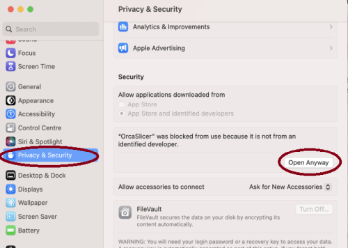

<div align="center">

# **THIS IS AN UNOFFICIAL MODIFIED FORK SEE <https://github.com/OrcaSlicer/OrcaSlicer> FOR THE OFFICIAL VERSION**

# DO NOT REPORT BUGS FOUND HERE TO THE OFFICIAL VERSION


<table border="2" style="border-color: #ffa500; background-color:rgb(232, 220, 180); color: #856404;">
<tr>
<td>
<strong>⚠️ CAUTION:</strong><br>
Several clickbait and malicious websites, such as <b>orca-slicer[.]com</b> and <b>orcaslicer[.]net</b>, are pretending to be the official OrcaSlicer site. These sites may redirect you to dangerous downloads or contain misleading information.<br>
<b>Our only official website is <a href="https://www.orcaslicer.com/">www.orcaslicer.com</a>.</b><br><br>
If you come across any of these in search results, please <b>report them</b> as unsafe or phishing to help keep the community secure with:<br>
 - <a href="https://safebrowsing.google.com/safebrowsing/report_phish/">Google Safe Browsing</a><br>
 - <a href="https://www.microsoft.com/en-us/wdsi/support/report-unsafe-site">Microsoft Security Intelligence</a><br>
 - <a href="https://ipthreat.net/tools/reportphishing">IPThreat</a>
</td>
</tr>
</table>

</div>

# **THIS VERSION IS AN UNOFFICIAL UNSTABLE FORKED VERSION, HERE BE DRAGONS!**

See <https://github.com/OrcaSlicer/OrcaSlicer> for the official version.

# Wiki

The wiki below aims to provide a detailed explanation of the slicer settings, including how to maximize their use and how to calibrate and set up your printer.

Please note that the wiki is a work in progress. We appreciate your patience as we continue to develop and improve it!

- **[Access the unofficial wiki here](https://github.com/NanahsiTheNameless/OrcaSlicer/wiki)**

# Download

## Stable Release

This fork **does not publish stable builds**, for stability and sanity **go to the official version** <https://github.com/OrcaSlicer/OrcaSlicer>

**ONCE AGAIN THIS FORK IS UNOFFICIAL AND UNSTABLE, HERE BE DRAGONS!**

## Nightly Builds

**[Download the Latest Nightly Build](https://github.com/NanashiTheNameless/OrcaSlicer/releases/tag/Nightly-Rolling)**

# How to install

## Windows

Download the **Windows Installer exe** for your preferred version from the [releases page](https://github.com/NanashiTheNameless/OrcaSlicer/releases/latest).

 - *For convenience there is also a portable build available.*
    <details>
    <summary>Troubleshooting</summary>
      If you need a torubleshooting guide you should use the official version, this version is for people who are experienced!

## Mac

1. Download the DMG for your computer (All mac builds are universal now).
2. Drag OrcaSlicer.app to Application folder.
3. *If you want to run a build from a PR, you also need to follow the instructions below:*

    <details>
    <summary>Quarantine</summary>

    - Option 1 (You only need to do this once. After that the app can be opened normally.):
      - Step 1: Hold _cmd_ and right click the app, from the context menu choose **Open**.
      - Step 2: A warning window will pop up, click _Open_

    - Option 2:
      Execute this command in terminal:

      ```shell
      xattr -dr com.apple.quarantine /Applications/OrcaSlicer.app
      ```

    - Option 3:
        - Step 1: open the app, a warning window will pop up
            
        - Step 2: in `System Settings` -> `Privacy & Security`, click `Open Anyway`:
            
    </details>

## Linux (Ubuntu)

 1. If you run into trouble executing it, try this command in the terminal:
    `chmod +x /path_to_appimage/OrcaSlicer_Linux.AppImage`

# How to Compile

All updated build instructions for Windows, macOS, and Linux are now available on the official [OrcaSlicer Wiki - How to build](https://github.com/NanahsiTheNameless/OrcaSlicer/wiki/How-to-build) page.

Please refer to the wiki to ensure you're following the latest and most accurate steps for your platform.

# Klipper Note

If you're running Klipper, it's recommended to add the following configuration to your `printer.cfg` file.

```gcode
# Enable object exclusion
[exclude_object]

# Enable arcs support
[gcode_arcs]
resolution: 0.1
```

OrcaSlicer was originally forked from Bambu Studio, it was previously known as BambuStudio-SoftFever.

**THIS VERSION IS AN UNOFFICIAL UNSTABLE FORKED VERSION, HERE BE DRAGONS!**

[Bambu Studio](https://github.com/bambulab/BambuStudio) is forked from [PrusaSlicer](https://github.com/prusa3d/PrusaSlicer) by Prusa Research, which is from [Slic3r](https://github.com/Slic3r/Slic3r) by Alessandro Ranellucci and the RepRap community.
OrcaSlicer incorporates a lot of features from [SuperSlicer](https://github.com/supermerill/SuperSlicer) by @supermerill
OrcaSlicer's logo is designed by community member Justin Levine (@freejstnalxndr).

# License

- **OrcaSlicer** is licensed under the GNU Affero General Public License, version 3. OrcaSlicer is based on Bambu Studio by BambuLab.
- **Bambu Studio** is licensed under the GNU Affero General Public License, version 3. Bambu Studio is based on PrusaSlicer by PrusaResearch.
- **PrusaSlicer** is licensed under the GNU Affero General Public License, version 3. PrusaSlicer is owned by Prusa Research. PrusaSlicer is originally based on Slic3r by Alessandro Ranellucci.
- **Slic3r** is licensed under the GNU Affero General Public License, version 3. Slic3r was created by Alessandro Ranellucci with the help of many other contributors.
- The **GNU Affero General Public License**, version 3 ensures that if you use any part of this software in any way (even behind a web server), your software must be released under the same license.
- OrcaSlicer includes a **pressure advance calibration pattern test** adapted from Andrew Ellis' generator, which is licensed under GNU General Public License, version 3. Ellis' generator is itself adapted from a generator developed by Sineos for Marlin, which is licensed under GNU General Public License, version 3.
- The **Bambu networking plugin** is based on non-free libraries from BambuLab. It is optional to the OrcaSlicer and provides extended functionalities for Bambulab printer users.
